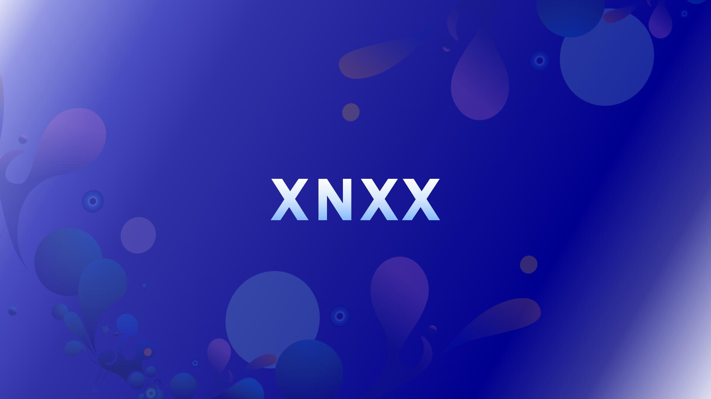

# XnxX.wa-Bot

  
  <a href="tiktok.com/">
  

    

  

#### Get Session ID

 ##  Deploy Methods
     

#### DEPLOY TO HEROKU 

1. If You don't have a account in Heroku. Create a account.
     

2. Now Deploy
     

#### DEPLOY TO RAILWAY

7. If You don't have a account in Railway. Create a account.
     

8. Now Deploy
     

#### DEPLOY TO MONGENIUS

9. If You don't have a account in Mongenius. Create a account.
     

10. Now Deploy
     

#### DEPLOY TO COOLIFY

11. If You don't have a account in Coolify. Create a account.
     

12. Now Deploy
     

#### DEPLOY TO RENDER

13. If You don't have a account in Render. Create a account.
     

14. Now Deploy
     

#### DEPLOY TO KOYEB

15. If You don't have a account in Koyeb. Create a account.
     

16. Now Deploy
     

#### DEPLOY TO CLEVER-CLOUD

17. If You don't have a account in Clever--Cloud. Create a account.
     

#### DEPLOY TO Toystack-Ai

18. If You don't have a account in Toystack-Ai. Create a account.
     

